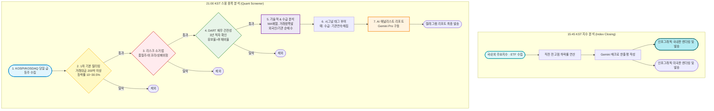

# 📈 K-Stock 퀀트 스윙 스크리너 & 시황 봇 가이드

**매일 한국 주식 시장(KOSPI/KOSDAQ)의 주도주를 자동으로 분석하고 텔레그램으로 리포트를 발송해 주는 봇의 기능, 분석 기준, 그리고 사용법을 정리한 공식 문서입니다.**

---

## 📌 1. 봇 소개 및 주요 기능

이 봇은 매일 자동으로 시장을 분석하여 투자자에게 가장 확률 높은 스윙(단기~중기) 종목을 선별해 주고, 시장의 흐름을 한눈에 파악할 수 있는 인포그래픽을 제공하는 **"나만의 AI 퀀트 애널리스트"**입니다.

### 🌟 2대 핵심 기능
1. **⏰ 15:45 마감 시황 인포그래픽 자동 발송 (지수 분석)**
   - 정규장 마감 직후 국내외 주요 지수의 위치와 변동성을 요약한 시각화 카드를 **국내 1장 / 미국 1장**으로 나누어 발송합니다.
2. **⏰ 21:00 스윙 주도주 심층 리포트 발송 (종목 분석)**
   - 엄격한 퀀트 조건, 재무, 수급을 모두 통과한 진짜 주도주만 선별하여 AI 분석 리포트를 발송합니다.
3. **🚨 실시간 리스크 · 분할매수 알림**
   - 국내 장중에는 KOSPI/KOSDAQ의 급락 경보와 사이드카를, 미국 장중에는 TQQQ/QLD의 분할매수 단계 진입을 감시합니다.

---

## 📊 2. 시장 지수 분석 로직 (15:45 마감 시황)

단순히 지수가 올랐다/내렸다가 아닌, **현재 지수의 진짜 위치**를 파악하기 위해 다각도로 분석합니다.

1. **분석 대상**
   | 구분 | 종목 | 티커 | 표기 단위 |
   | :--- | :--- | :--- | :--- |
   | 🇰🇷 국내 지수 | KOSPI | `^KS11` | pt |
   | 🇰🇷 국내 지수 | KOSDAQ | `^KQ11` | pt |
   | 🇺🇸 미국 지수 | S&P 500 | `^GSPC` | pt |
   | 🇺🇸 미국 지수 | NASDAQ 100 | `^NDX` | pt |
   | 🇺🇸 미국 ETF | TQQQ (나스닥100 3배) | `TQQQ` | USD |
   | 🇺🇸 미국 ETF | QLD (나스닥100 2배) | `QLD` | USD |

   > 종목 추가는 `index_closing.py`의 `INDICES` 딕셔너리에 한 줄만 넣으면 텍스트 리포트와 인포그래픽에 자동 반영됩니다.

2. **데이터 소스 (종목·용도별)**

   | 용도 | 국내 (KOSPI/KOSDAQ) | 미국 (S&P500/NASDAQ100/TQQQ/QLD) |
   | :--- | :--- | :--- |
   | 당일 종가·등락률 | KIS → 키움 → 토스 → 네이버 (4중 폴백) | 야후 파이낸스 |
   | 전고점 일봉 (5년) | **KRX(pykrx)** → 야후 (폴백) | 야후 파이낸스 |
   | 장중 실시간 (TQQQ/QLD) | — | 야후 파이낸스 |

   > **국내 지수는 야후 파이낸스에 의존하지 않습니다.** 전고점 계산용 일봉도 한국거래소(KRX) 데이터를 1순위로 사용하며, KRX 조회가 실패할 때만 야후로 폴백합니다. 실행 로그에 어떤 소스가 쓰였는지 표시됩니다.
   > - `📗 KOSPI 전고점 데이터 소스: KRX (pykrx), 1234일치` → 정상
   > - `📙 KOSPI 전고점 데이터 소스: yfinance (KRX 조회 실패로 폴백)` → KRX 실패, 아래 KRX 계정 설정 참고
   >
   > 미국 종목은 pykrx로 조회할 수 없어(한국거래소 전용) 야후 파이낸스를 사용합니다.

   - ⚠️ 미국장은 한국시간 새벽에 마감되므로 15:45 리포트의 미국 수치는 **직전 거래일 종가**입니다. 인포그래픽 카드와 텍스트 표에 기준일(예: `7/28 종가 기준`)을 함께 표기합니다.
3. **직전 전고점 대비 하락률 (Swing High Analysis)**: 
   - 과거 5년 치 차트 데이터를 분석하여, 최근 15일 거래일(약 3주) 기준 가장 높았던 **'직전 전고점(Local High)'**을 수학적으로 찾아냅니다.
   - 현재 지수가 이 전고점 대비 얼마나 하락해 있는지(예: `-4.5%`)를 계산하여, 현재 시장이 상승장인지 단기 조정장인지 수치로 직관적으로 보여줍니다.
4. **AI 매크로 한줄평 생성**:
   - 20년 경력의 수석 매크로 애널리스트 페르소나를 부여받은 Gemini AI가 수집된 지수 데이터를 바탕으로 오늘 시장의 국면과 변동성에 대한 **'핵심 통찰 1줄 숏 코멘트'**를 작성합니다.
   - 예: *"현재 시장의 변동성이 지속되고 있으며, 주요 지지선 및 저항선 부근에서의 리스크 관리가 필요한 국면입니다."*

---

## 🚨 2-1. 실시간 알림 항목

| 알림 | 대상 | 감시 시간 | 주기 | 발동 조건 |
| :--- | :--- | :--- | :--- | :--- |
| 지수 급락 경보 | KOSPI / KOSDAQ | 09:00~15:30 KST | 15분 | 전고점 대비 5% 단위 하락 돌파 (KOSPI -10%↑, KOSDAQ -20%↑) |
| 사이드카 자체 감지 | KOSPI / KOSDAQ | 09:00~15:30 KST | 90초 | 당일 등락률 KOSPI ±5%, KOSDAQ ±6% |
| **레버리지 ETF 분할매수** | **TQQQ / QLD** | **미국 정규장 (09:30~16:00 ET)** | **30분** | **전고점 대비 낙폭 단계 진입** |

### 레버리지 ETF 분할매수 기준

| 종목 | 1차 진입 | 추가 매수 간격 | 예시 |
| :--- | :---: | :---: | :--- |
| TQQQ | -10% | **1%마다** | -10% 1차, -11% 2차, -12% 3차 … |
| QLD | -10% | **5%마다** | -10% 1차, -15% 2차, -20% 3차 … |

- 같은 단계는 **하루 1회만** 발송됩니다. 전고점을 회복하면 상태가 초기화되어, 다시 하락 돌파할 때 재알림됩니다.
- 미국장은 한국시간 자정을 넘겨 이어지므로, 알림 상태는 KST 날짜가 아닌 **미국 동부(ET) 거래일 기준**으로 관리됩니다.
- 개장 판정도 KST 고정 시각이 아닌 ET 기준이므로 **서머타임(EDT/EST)에 자동 대응**합니다. (KST 기준 여름 22:30~05:00 / 겨울 23:30~06:00)
- 로직 검증: `python test_leverage_alerts.py` (실제 발송 없이 티어 계산·중복방지·개장판정을 점검)

---

## ✅ 2-2. 자동 테스트 (GitHub Actions)

`main` 브랜치로의 push와 PR마다 `.github/workflows/ci.yml`이 자동 실행됩니다.

| 단계 | 내용 |
| :--- | :--- |
| 문법 검사 | `compileall`로 전체 파이썬 파일 컴파일 |
| 임포트 검증 | 주요 모듈 임포트 (순환 임포트·오타 조기 발견) |
| 알림 로직 테스트 | `test_leverage_alerts.py` — 티어 계산, 중복 발송 방지, ET 기준 개장 판정 |
| 렌더링 테스트 | `test_report_render.py` — 메타데이터 정합성, 숫자 포맷, 텍스트 리포트, Jinja 템플릿 |

로컬에서도 동일하게 실행할 수 있습니다.

```bash
python test_leverage_alerts.py
python test_report_render.py
```

- 두 테스트 모두 **네트워크 호출과 텔레그램 발송을 목업으로 대체**하므로 API 키 없이 실행됩니다.
- CI는 Playwright 브라우저 바이너리를 받지 않습니다. 스크린샷 촬영은 검증 대상이 아니며 Jinja 렌더링까지만 확인합니다.
- ⚠️ 야후 파이낸스 실시세 조회는 자동 테스트 범위 밖입니다. 티커 추가 시에는 `python swing_main.py --now-index`로 직접 확인하세요.

---

## 🔍 3. 스윙 종목 분석 로직 (21:00 주도주 스크리너)

봇이 종목을 선별하는 과정은 매우 까다롭고 체계적입니다. 위험한 주식을 걸러내고, 진짜 돈이 몰리는 주식만 남기는 5단계 필터링 과정을 거칩니다.



### 🔎 종목 스크리닝 세부 기준

1. **기본 퀀트 필터링 (거래대금 & 수익률)**
   - **등락률**: 당일 **10% ~ 30.5%** 상승한 종목 (초기 상승부터 상한가까지 포착)
   - **거래대금**: 당일 거래대금 **200억 원 이상** (유동성이 풍부하여 매매가 쉬운 종목만 대상)

2. **리스크 소거법 (위험 종목 완벽 차단)**
   - **품절주 차단**: 최근 20일 평균 거래량이 10만 주 미만인 소외주 제외
   - **위꼬리 차단**: 장중 최고가는 25% 이상 급등했으나, 종가가 10% 미만으로 크게 하락한 종목 제외 (차익 실현 매물 폭탄 회피)
   - **상폐/관리 종목 차단**: 최신 부채비율이 500%를 초과하는 극도 위험군 제외

3. **DART 재무 건전성 검증**
   - 3년 연속 당기순이익 적자 기업 제외
   - 3개년 연속 **"유보율 > 부채비율"** 조건을 충족하는 재무 튼튼 기업만 통과

4. **기술적 추세 및 수급 분석 (핵심 시그널)**
   - **기술적 지표**: 1000일 장기 이평선 위치, 5-20-60일 단기 이평선 정배열 여부, 20일 평균 대비 거래량 폭발 비율 측정
   - **수급 지표**: KIS(한국투자증권) API를 통해 외국인/기관의 양매수, 혹은 연속 매집 여부 파악

5. **AI 리포트 생성 및 태깅**
   - 통과한 종목에 직관적인 시그널 태그 부착 (예: `[수급: 기관 연속매집] [기술적: 거래량폭발+정배열]`)
   - 차트와 뉴스를 종합하여 매수/매도/손절 전략 텍스트 생성

---

## 🛠️ 4. 봇 사용 방법 (순서대로 따라 하기)

처음 봇을 구동하는 관리자를 위한 세팅 및 실행 가이드입니다.

### 1단계: API 키 준비 및 `.env` 설정
봇이 외부 증권 데이터와 AI, 텔레그램을 사용하기 위해 인증키가 필요합니다.
프로젝트 최상단 폴더에 `.env` 파일을 생성하고 아래 내용을 채워 넣습니다.

```ini
# 한국투자증권(KIS) API 키 (수급 및 차트 데이터)
KIS_APP_KEY=발급받은_키
KIS_APP_SECRET=발급받은_시크릿키
KIS_ENV=PROD

# DART API 키 (기업 재무제표 확인)
DART_API_KEY=발급받은_키

# Google Gemini API 키 (AI 리포트 작성)
GEMINI_API_KEY=발급받은_키

# 텔레그램 봇 토큰 및 받을 채팅방 ID
TELEGRAM_BOT_TOKEN=봇파더에게_받은_토큰
TELEGRAM_CHAT_ID=내_채팅방_ID

# (선택) KRX 정보데이터시스템 로그인 정보 - pykrx 수급/지수 조회용
# data.krx.co.kr 에서 무료 회원가입 후 아이디/비밀번호를 입력하세요.
# 미입력 시에도 KRX 일봉(주가) 폴백은 정상 동작합니다.
KRX_ID=KRX_사이트_아이디
KRX_PW=KRX_사이트_비밀번호
```

> **KRX 계정을 넣어야 하나요?** — 필수는 아닙니다.
> pykrx는 로그인 세션이 없으면 일반 요청으로 조회를 시도하므로(`pykrx/website/comm/webio.py`), 계정 없이도 국내 지수 일봉이 조회될 수 있습니다.
> 봇 시작 시 뜨는 `KRX 로그인 실패: KRX_ID 또는 KRX_PW 환경 변수가 설정되지 않았습니다.` 메시지는 **오류가 아니라 안내**이며, 이 상태로도 정상 동작합니다.
>
> 다만 실행 로그에 `📙 ... yfinance (KRX 조회 실패로 폴백)`이 계속 뜬다면 KRX가 비로그인 조회를 막고 있는 것이므로, 그때 `KRX_ID`/`KRX_PW`를 채우고 봇을 재시작하세요. 설정 후 `📗 ... KRX (pykrx)`로 바뀌면 정상입니다.
> 💡 *팁: 내 텔레그램 채팅방 ID를 모르겠다면 `python get_chat_id.py` 스크립트를 실행하여 쉽게 찾을 수 있습니다.*

### 2단계: 필수 프로그램 패키지 설치
터미널(명령 프롬프트)을 열고 폴더로 이동한 뒤, 봇 구동에 필요한 파이썬 라이브러리와 브라우저 환경을 설치합니다.

```bash
# 1. 파이썬 라이브러리 설치
pip install -r requirements.txt

# 2. 인포그래픽 이미지 생성을 위한 브라우저 설치
python -m playwright install chromium
```

### 3단계: 봇 실행하기

> ⚠️ **리눅스 서버(OCI/Ubuntu)에서는 `python` 명령이 없습니다.**
> Ubuntu에는 `python3`만 설치되어 있어 `python swing_main.py`를 실행하면
> `Command 'python' not found` 오류가 납니다. **반드시 가상환경(venv)을 먼저 활성화**하세요.
> venv를 거치지 않고 `python3`로 실행하면 `ModuleNotFoundError: No module named 'yfinance'`가 발생합니다.
>
> ```bash
> cd ~/stock_bot
> source venv/bin/activate      # 이후에는 python 명령을 그대로 사용 가능
> python swing_main.py --now-index
> ```
>
> 활성화 없이 한 줄로 실행하려면 venv 안의 파이썬을 직접 지정합니다.
> ```bash
> ~/stock_bot/venv/bin/python ~/stock_bot/swing_main.py --now-index
> ```
>
> venv 폴더명이 다르거나 확실하지 않다면, 서비스가 실제로 쓰는 인터프리터 경로를 확인하세요.
> ```bash
> systemctl cat stock_bot | grep ExecStart
> ```

봇은 용도에 따라 두 가지 방식으로 실행할 수 있습니다. (아래 `python`은 venv 활성화 상태 기준)

#### A. ⏰ 자동 스케줄러 모드 (추천)
컴퓨터나 서버를 켜두면 매일 정해진 시간에 스스로 알아서 동작합니다.
```bash
python swing_main.py
```
- **오후 3시 45분**: 자동으로 지수 마감 인포그래픽을 텔레그램으로 보냅니다.
- **오후 9시 00분**: 스윙 종목 분석 리포트와 분석 원본 엑셀(CSV) 파일을 텔레그램으로 보냅니다.

#### B. ⚡ 수동 즉시 실행 모드 (테스트용)
기다리지 않고 지금 당장 결과물을 받아보고 싶을 때 사용합니다.
- **스윙 종목 분석 당장 실행하기**:
  ```bash
  python swing_main.py --now
  ```
- **마감 지수 인포그래픽 당장 실행하기**:
  ```bash
  python swing_main.py --now-index
  ```
  > 종목 6개를 조회하고 인포그래픽을 2장 렌더링하므로 **완료까지 1~3분** 걸릴 수 있습니다.
  > 중간 출력이 적어 멈춘 것처럼 보여도 정상입니다.

---

## 📱 5. 최종 결과물 예시 (텔레그램 화면)

봇이 정상적으로 작동하면 매일 저녁 여러분의 텔레그램으로 아래와 같은 메세지가 도착합니다.

> 📊 **[오후 3시 45분 국내외 주요 지수 마감 정산]**
> | 지수명 | 당일 종가 (전일대비) | 직전 전고점 대비 |
> |---|---|---|
> | **KOSPI** | 2,750.12 (▲15.20pt, +0.55%) | -2.1% |
> | **KOSDAQ** | 860.30 (▼5.10pt, -0.60%) | -5.4% |
> 
> 💡 **매크로 한줄평**
> - KOSPI는 반도체 대형주 중심의 강세로 반등했으나, KOSDAQ은 2차전지 약세로 하락하며 차별화 장세가 이어지고 있습니다.

> 🚀 **[오후 9시 스윙 주도주 브리핑]**
> 
> 🏆 **오늘의 TOP 스윙 추천주**
> ■ 종목명: **삼성전자 (005930)** [KOSPI] **[수급: 외인기관 양매수] [기술적: 거래량폭발+정배열]**
> - 주도 테마: 온디바이스 AI, 반도체
> - 당일 등락률: +6.50% | 거래대금: 8,500억 원
> - 💰 예상 매수가: 81,000원 부근 (단기 눌림목 노림)
> - 🎯 목표 매도가: 88,000원 이상 익절
> - 🛑 손절가: 78,000원 이탈 시 손절
> - 💡 추천 사유: 최근 외국인 3일 연속 대량 매집 포착 및 60일선 돌파 상승 파동 시작.

---

## 🔄 6. 서버 자동 업데이트 (OCI)

GitHub `main` 브랜치에 새 커밋이 올라오면 **OCI 서버가 3분 이내에 자동으로 감지**하여 코드를 받고(`git pull`) 봇을 재시작합니다.

- 동작 원리: 서버의 cron이 3분마다 `/home/ubuntu/auto_update.sh`를 실행 → 새 커밋 발견 시 `git pull` + `pip install -r requirements.txt` + `systemctl restart stock_bot`
- 업데이트 기록 확인: 서버의 `logs/auto_update.log` 파일
- 로컬 봇 실행 여부와 무관하게, **어디서든 push만 하면 서버에 자동 반영**됩니다.

---

## 📁 7. 프로젝트 구조

*   `swing_main.py`: 파이프라인 진입점 (스케줄러, 실시간 감시 루프, CLI 모드 제어).
*   `config.py`: 환경 변수 로드 및 설정 검증.
*   `scraper.py`: DART, 네이버, 구글 뉴스 등 웹 및 API 스크래핑 엔진.
*   `quant_filter.py`: 1차 수치/이평선 필터 및 DART 재무 필터 실행부.
*   `index_closing.py`: 15:45 마감 시황 지수/ETF 분석, 매크로 한줄평 생성, 급락·사이드카·레버리지 ETF 알림 로직.
*   `infographic_generator.py`: Playwright 및 HTML 템플릿 기반 인포그래픽 이미지 렌더링 (국내/미국 2장 분리 발송).
*   `templates/infographic_widget.html`: 인포그래픽 카드 템플릿. 카드는 `cards` 목록을 순회해 생성되므로 종목 추가 시 수정 불필요.
*   `report_generator.py`: Gemini API 연동 및 로컬 분석 보고서 컴파일.
*   `notifier.py`: 텔레그램 메시지 포맷팅 및 분할 발송 로직.
*   `chat_manager.py`: 텔레그램 수신 대상 채팅방 ID 관리.
*   `bot_listener.py`: 텔레그램 챗봇 명령 수신 리스너.
*   `kis_api.py` / `kiwoom_api.py` / `toss_api.py` / `krx_api.py`: 국내 시세·수급 조회 API 연동 (4중 폴백).
*   `get_chat_id.py`: 텔레그램 연동 도우미 스크립트.
*   `requirements.txt`: 의존 패키지 목록.
*   `.gitignore`: 업로드 방지용 설정 파일.

### 테스트 파일

*   `test_leverage_alerts.py`: TQQQ/QLD 분할매수 티어 계산, 중복 발송 방지, 미국장 개장 판정 검증. **CI 자동 실행.**
*   `test_report_render.py`: 종목 메타데이터, 숫자 포맷, 15:45 리포트, 인포그래픽 렌더링 검증. **CI 자동 실행.**
*   `test_sidecar.py`: 사이드카 알림 수동 점검용 (목업 데이터로 실제 텔레그램 발송).
*   `test_alert.py`: 급락 경보 메시지 서식 수동 점검용 (실제 텔레그램 발송).

> `test_sidecar.py`와 `test_alert.py`는 실제로 텔레그램 메시지를 보내므로 CI에서는 실행하지 않습니다.
